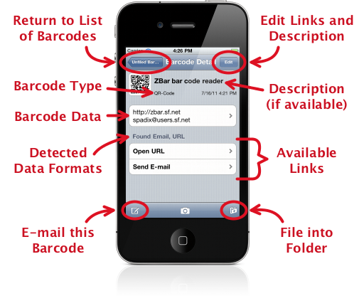

.. _barcode-detail:

*******************
  Barcode Details
*******************

This screen shows lots of detailed information about a scanned barcode:

.. _edit-description:

Barcode Description
===================

If the app can not find a better alternative, the descriptive text for a
barcode defaults to the raw barcode data.  This can make a list of barcodes
hard to work with - for example, trying to find a specific package in a list
of tracking numbers.  To help you organize your barcodes, you may find it
helpful to write your own description:

.. list-table::
   :widths: 1 99
   :class: imglist

   * - |edit icon|
     - Tap the "Edit" button, then tap on the description and enter the
       desired text.

If you clear an existing description, the barcode data will be shown instead.

.. _copy-data:

Copying Data
============

.. list-table::
   :widths: 1 99
   :class: imglist

   * - |copy screenshot|
     - Tap on the barcode data to see it full screen or copy a specific
       selection.  Tap and *hold* for a second to copy the full data directly
       to the clipboard.

Generated Links
===============

.. list-table::
   :widths: 1 99
   :class: imglist

   * - |link screenshot|
     - At the bottom is a list of all the links that were generated for this
       barcode.  Simply tap on a link to activate it.

.. tip::

   Links with the internal disclosure arrow (|internal|) will be opened
   directly in the ZBar app, while links with the external disclosure arrow
   (|external|) will take you out to another application.

.. important::

   If the barcode data is not recognized, no links will be available!
   However, if you know what to do with the data, you should be able to
   :ref:`create your own links <add-link>`.

.. _move-barcode:

Filing into a Folder
====================

.. list-table::
   :widths: 1 99
   :class: imglist

   * - |organize icon|
     - Tap the "Organize" folder in the toolbar, then select the destination
       folder from the list of available folders.

.. tip::

   You must :ref:`add the folder <add-folder>` before you can move a barcode
   into it.

Other Actions
=============

You can also :doc:`edit the list of links <links>` or use the toolbar to
:ref:`share this barcode <export-one>` or :doc:`scan another barcode
<scanning>`.
