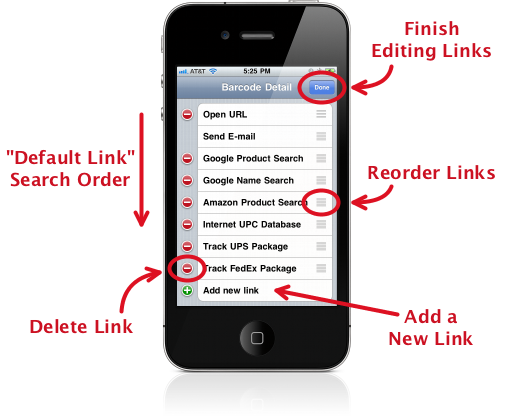

.. _links:

******************
  Managing Links
******************

A *link* is a URL that points to a web page, email address or even another
app.  After you scan a barcode, the ZBar app analyzes the data.  If the data
format is recognized, a number of links may be generated allowing you to take
action related to the barcode.  It may help to think of these like "internet
bookmarks" that are customized for each barcode.

Links may be manipulated by navigating to the :ref:`barcode-detail` for any
barcode and tapping "Edit".  This will expand the list to include all
available links, whether they apply to the current barcode or not.

.. _default-link:

The Default Link
================

By default, the *first available* link will be opened automatically, as soon
as the barcode is scanned.  You can :ref:`change the link order <move-link>`
to determine which link is first, or :ref:`disable <config>` this feature
entirely if you prefer.

.. _move-link:

Reordering Links
================

.. list-table::
   :widths: 1 99
   :class: imglist

   * - |move icon|
     - Grab the link by the grippy texture on the right and drag it to the new
       position.

Deleting a Link
===============

.. list-table::
   :widths: 1 99
   :class: imglist

   * - |red minus|
     - Tap the red minus in front of the link and confirm the deletion.

.. important::

   If you delete any of the built-in links, you will not be able to get them
   back without deleting and re-installing the app (or re-entering them
   manually).

.. _add-link:

Adding a New Link
=================

.. list-table::
   :widths: 1 99
   :class: imglist

   * - |green plus|
     - Scroll to the bottom of the list and select the last entry "Add new
       link" (with the green plus '+').  This will present an empty :ref:`link
       editing screen <edit-link>` for you to fill in.

.. _edit-link:

Editing Links
=============

Tap on an existing link to edit it using the link editing screen.

Name
   This is what you see in the barcode detail when the link is available.

URL
   The template that defines how to build a link from the barcode data (more
   about templates in a moment).

Open Option
   Determine how the link is opened.  This setting allows you to override the
   app settings and force this link to open in the app or in Safari.

Data Formats
~~~~~~~~~~~~

The data encoded in a barcode can have many different interpretations, which
are not necessarily determined by the :ref:`type of barcode <symbologies>`.
The ZBar app recognizes a fixed number of unambiguously identifiable formats;
the current list includes:

* Web page URLs

* Email addresses

* Product codes scanned from `GS1`_ :ref:`symbologies <symbologies>`.

   + `GTIN`_ product codes 
   + `ISBN`_ book codes

* Package tracking numbers

   + UPS Ground tracking numbers
   + FedEx Ground and FedEx Express tracking numbers

This list is always growing - expect new formats in future versions of the
app.

.. _GS1: http://wikipedia.org/wiki/GS1
.. _GTIN: http://wikipedia.org/wiki/Global_Trade_Item_Number
.. _ISBN: http://wikipedia.org/wiki/International_Standard_Book_Number

Link templates
~~~~~~~~~~~~~~

.. important::

   Manipulating link templates is an advanced feature.  In order to provide
   the most flexibility, the template interface requires a minimal technical
   understanding of URLs and template substitution.

   If you change any of the built-in links, there is no way to automatically
   reset them - to get them back you will need to re-enter them manually or
   delete and re-install the app.

   This should not scare you away from playing with links!  By all means, play
   away.  We just recommend that you create new links for your playground so
   the default links will always be available.

Link URLs are entered as *templates*, which define where specific data from a
barcode should be substituted into a URL.  The template contains
*placeholders* for recognized data formats which might be parsed from barcode
data.  These placeholders determine three things:

1. Which barcodes the link applies to - the link will only be available when
   *all* of the placeholder data formats from the template are found in the
   barcode data.

2. What data to use in the URL - each placeholder specifies which data to use
   from the barcode.  Keep in mind that this may or may not be the entire
   barcode data - in several cases the data is re-formatted, so it may not
   even be found directly in the original barcode.

3. Where to put the data in the URL - the placeholders are replaced by the
   formatted data to create the actual link.  Text around the placeholders is
   copied from the template unchanged.

While editing the template, placeholders may be inserted by tapping the plus
'+' icon at the top of the "Edit Template" screen.

Finding Link Templates
~~~~~~~~~~~~~~~~~~~~~~

The best way to derive a URL template for a site is to find any API
documentation they offer.  Many sites are starting to publish their interface
for just this purpose.

If you can't find documentation, you can try performing a lookup manually,
using a sample barcode.  Take the destination URL generated by your lookup and
replace the sample barcode data with an appropriate placeholder.

Sometimes the search URL does not contain the barcode data, or replacing it
with other data does not work.  In this case you may need to revert to the
HTML source of the search page to find an appropriate link.

If javascript is involved, it *may not even be possible* to create a simple
link like this - some sites really don't want you linking to their generated
content.

.. tip::

   If you do create a new link, feel free to share it by :doc:`posting the
   template in the app forum <support>`!  If we like it, we may even include
   your link in a future version of the app.

Examples
========

The trick, of course, is figuring out what URL template to use.  An example
should help:

Bing Search
~~~~~~~~~~~

I have a site I want to search for products - Bing.com - and I have a barcode
(from my cereal box) that I want to search for... Now what?

1. The first step is to determine the data format: so just scan the barcode!
   In this case the barcode detail says the app found a "Product".  That means
   all of the GTIN data formats are available.

2. Next, perform the search manually.  Head over to bing.com and enter the
   barcode data in the search bar: 038000394928.  This is the GTIN-12 scanned
   from the barcode (note the 12 digits).  Searching...yay, Cocoa Krispies!

3. Now look at the URL generated by the search form and find the barcode data
   you entered::

      http://www.bing.com/search?q=038000394928&go=&qs=n&sk=&sc=1-12&form=QBRE
                                   ^^^^^^^^^^^^

4. Convert the URL to a template by replacing the specific barcode data
   ("038000394928") with the matching data format placeholder (GTIN-12).
   Usually you can just copy the URL from Safari, paste it into the app and do
   the substitution there::

      http://www.bing.com/search?q={GTIN-12}&go=&qs=n&sk=&sc=1-12&form=QBRE

5. Now create the link - tap "Edit" from the barcode detail, tap "Add new
   link".  Enter a name ("Bing Search") and then paste or enter the template.
   Enter the ``{GTIN-12}`` placeholder by tapping the plus '+' and looking
   under "Products".  Note that, if you enter the placeholder manually from
   another app, you need to surround the format tag with curly braces (``{}``)

6. Save everything and back out to the product detail.  If you scan a UPC-A
   product, you should see "Bing Search" in the list.  Tapping that should
   search for the scanned product.

.. tip::

   More advanced users may want to try "trimming the cruft" from the URL.
   Even though they don't (usually) hurt anything, I don't care for the extra
   (often unnecessary) query parameters added by the search forms, so I
   usually end up trying to take them out.  If you do try this, you'll find
   that the minimal version works just as well in this case::

      http://www.bing.com/search?q={GTIN-12}

.. tip::

   Usually a GTIN-13 would be preferred to the shorter GTIN-12 - many products
   do not have a GTIN-12, but there is always an equivalent GTIN-13 that
   identifies the same product.  Unfortunately, when I searched Bing for
   "0038000394928" (with the extra leading zero), no results were returned!
   It looks like this particular site does not understand the GTIN equivalence
   (contrast to Google, where both searches work fine).

   If you also want to search Bing for products that have only a GTIN-13
   (eg, most books), you can add another link, using the same URL with a
   GTIN-13 placeholder.
