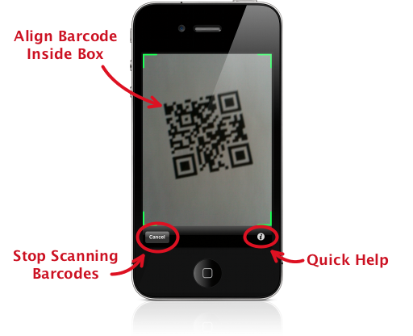

.. _scanning:

*********************
  Scanning Barcodes
*********************

.. list-table::
   :widths: 1 99
   :class: imglist

   * - |camera icon|
     - Tap the camera icon from anywhere in the application to start scanning
       barcodes.

.. _basic-scanning:

Basic Scanning
==============

Hold your device upright, in *portrait* orientation, keeping the barcode
steady in the scan box.  The scanner needs a *well lit*, *in-focus* picture of
the barcode in order to read it.

* :doc:`Recognized barcodes <symbologies>` will be detected automatically;
  there is no "scan" button to tap.
* It may take a moment for the camera to auto-focus, just hold still while
  it's working.
* The barcode should be mostly horizontal or vertical; avoid scanning at an
  angle.
* The entire barcode must be in the frame - if you can't see the edges, you
  are too close.
* The camera should be about 4-6 inches (10-15 cm) from a "normal" size
  barcode.  It is possible to be too close; if the camera refuses to focus
  try backing off some.

Long Barcodes
=============

To scan longer barcodes - such as tracking numbers - you should rotate your
device sideways, to *landscape* orientation.  Again, hold the barcode steady
in the long, skinny scan box.  If the barcode is really long, it may help to
:ref:`zoom out <zooming>`.

.. image:: static/scanner-land-ann.png
   :alt: annotated landscape scanner
   :align: center
   :width: 704px
   :height: 239px

.. important::

   You must use :ref:`portrait orientation <basic-scanning>` to scan QR Codes.

.. _zooming:

Zooming
=======

You may need to zoom out in order to scan very large and dense barcodes.
Un-pinch the image on the screen to zoom out and maximize the resolution.

It may help to zoom in for very small, high-resolution barcodes.  Pinch the
screen to zoom in.

.. _scan-image:

Scanning a Saved Image
======================

.. list-table::
   :widths: 1 99
   :class: imglist

   * - |plus icon|
     - You can also scan images saved in your photo library.  Tap the plus '+'
       icon from the barcode list and select "Scan from image file", then
       select the image you wish to scan.
