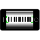
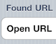
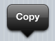
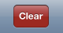
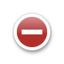

.. |camera icon| image:: static/camera.png
   :alt: camera icon
   :width: 80px
   :height: 80px

.. |portrait icon| image:: ../rsrc/portrait.80.png
   :alt: portrait orientation icon
   :width: 80px
   :height: 80px

.. |barcodes screenshot| image:: static/barcodes.png
   :alt: back to barcode detail screenshot
   :width: 80px
   :height: 42px

.. |edit icon| image:: static/edit.png
   :alt: edit button screenshot
   :width: 80px
   :height: 42px

.. |move icon| image:: static/move.png
   :alt: move grippy
   :width: 80px
   :height: 64px

.. |green plus| image:: static/green-plus.png
   :alt: green plus add button
   :width: 80px
   :height: 80px

.. |plus icon| image:: static/add.png
   :alt: add barcode icon
   :width: 80px
   :height: 80px

.. |organize icon| image:: static/organize.png
   :alt: organize folder icon
   :width: 80px
   :height: 80px

.. |internal| image:: static/disclosure.png
   :alt: internal disclosure icon
   :width: 13px
   :height: 13px

