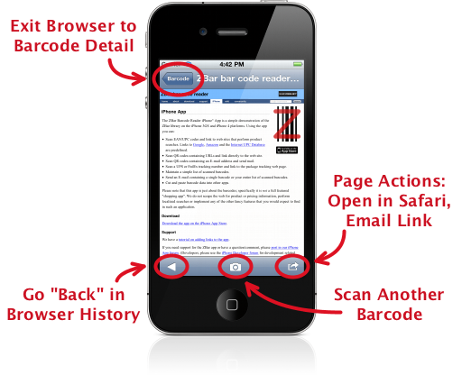

.. _browser:

**********************
  Integrated browser
**********************

Web page links open in the ZBar app embedded browser.  This works like a
simplified version of the system browser, allowing you to quickly view a web
page without leaving this app.

Using the Browser
=================

* Browse web pages
* Navigate back through your history
* Email a link to the web page
* Re-open the page in Safari if you need more browser functionality.
* Open the barcode scanner to immediately :doc:`scan another barcode
  <scanning>`.

.. tip::

   Browser history is not saved; once you leave the browser, you will have to
   start again at the original barcode link.  If you want to save the current
   web page, re-open it in Safari or send the link in an email.

Mail Composition
================

Similarly, email addresses open using an in-app mail composer.  Use this to
send an email without leaving the ZBar app.
